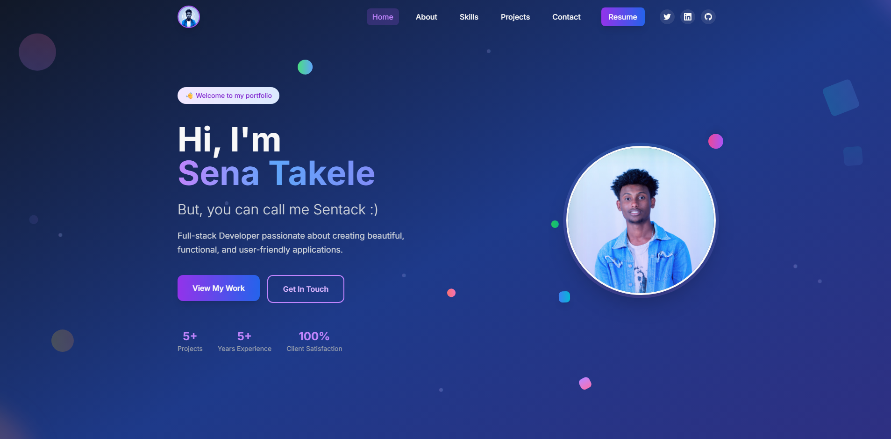

Here is the full `README.md` content in Markdown format:

````markdown
# React Portfolio Website

A minimal, modern, and responsive personal portfolio built using **ReactJS** and **TailwindCSS**. This portfolio highlights your education, experience, and projects, with seamless transitions and engaging animations.

## 🚀 Live Demo

[🔗 View Portfolio](https://sentack-portfolio.vercel.app/)

## 📸 Screenshot



---

## ✨ Features

- Clean and modern UI/UX
- Responsive layout for all devices
- Animated transitions and smooth scrolling
- Project showcase section
- Timeline for experience & education
- Contact section with form (optional)

---

## 🔧 Technologies Used

- ReactJS
- TailwindCSS
- JavaScript
- Framer Motion (for animations)
- EmailJS (optional for contact form...NOT INCLUDED IN HERE"

---

## 🛠️ Getting Started

### Clone the Repository

```bash
git clone https://github.com/sentack/react-portfolio.git
cd react-portfolio
```
````

### Install Dependencies

```bash
npm install
```

### Start the Development Server

```bash
npm run dev
```

---

## 🧾 What to Edit After Cloning

1. **Update Personal Information**

   - `src/details.js` – Look at the details in the file and update each info into yours.

````

2. **Update SEO Metadata**

  * Edit `index.html` inside `public/` to modify the `<title>`, `<meta>` tags, and favicon.

3. **Customize Styling**

  * TailwindCSS classes can be modified in the components to fit your personal style.
  * Global settings can be updated in `tailwind.config.js`.

---

## 🧱 Build for Production

```bash
npm run build
````

---

## 📄 License

This project is open source and available under the [MIT License](LICENSE).

---

## 🤝 Contributions

Contributions, issues, and feature requests are welcome!

---

> Built with 💻 by [Sentack](https://github.com/sentack)
